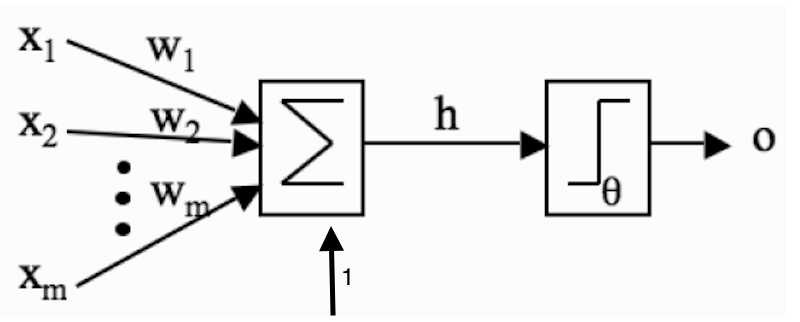

### Introduction 
After starting my studies about machine learning at the college, I have been talking with people about it since then and I've come to 
realize that people, even with more technical backgroundi, still think about machine learning algorithms as a black box. Therefore I wanted 
to write this post showing how to implement the first proposed neural network model called Perceptron from scratch using R programming 
language. I am going to walk you guys throught the whole process, take a look and see what is inside of this black box. 

### Neural Network Perceptron
Neural network is a concept inspired on brain, more specifically in its ability to learn how to execute tasks. Actually, it is an 
attempting to model the learning mechanism in an algebraic format in favor to create algorithms able to lear how to perform simple 
tasks. Learning mechanism is such a hard subject which has been studying for years without a full understanding, however some concepts 
were postulated to explain how learning occurs in the brain, the principal one is plasticity: modifying strength of synaptic connections 
between neurons, and creating new connections. In 1949, Donald Hebb first postulated how the strength of these sinapses gets adapted, he 
says that the changes in the strength of synaptic connections are proportional to the correlation in the firing of the two connecting 
neurons. Does it sounds hard to get it right? Let me clarify things here. He simply said that if two neurons consistently fire 
simultaneously, then any connection between them will change in strength, becoming stronger. For example, do you remember the first time
that you ate pizza from a new place and you loved the flavors? It was so good, right? Well, in that moment a set of neurons in your brain were
stimulated positively, because you got happy tasting that pizza's flavours from new place, since these neurons fired at same time, it
probably were connected together or created a new connection. Eventually, when you hear about that place from some friend or see an 
advertising, it will be enough to make you think about great taste of pizza again.

In order to simulate this mechanism, a mathematical model able to capture and reproduce only essential and basic properties of it was 
purposed by McCulloch and Pits, the model is named Perceptron and can see it in a figure below: 



The main characteristic of Perceptron is to have only one neuron. Basically, the model is composed by a set of inputs ( x1, x2, ..., xm ),
weights ( w1, w2, .., wm ) and an activation function. The inputs represent the stimulus, the weights copy the strength of connections 
between neurons and the activation function imitates the property of neuron fire or not. All this elements together emulate a perceptron model
which is nothing more than a mathematical operator that sums up all weights multiplyied by inputs and the result is an input for activation function
that provide a type of output as long as the result of the sum is greather than a threshold or other type of output, otherwise. 

See, this is not that complicated model. I hope you are doing great so far, you can realize that neural network is nothing more than 
multiplications and sum whose result is applied to a function. And this is what really is.

Now, we need to map these stimulus in the inputs. Recall the example about eating delicious pizza in a new place. The stimulus was the taste of
pizza and the tag was that the pizza was really good, so you learned that the pizza from that new place tastes good. Taste is not the only 
characteristic that make that pizza really good, in general, pizza has more observable features such as: size, format, smell, color, weigth, 
consistency, temperature and so on, this set of features compose the concept of "good pizza" and this is exactly how we learning things from 
real world. Think about another example: How did you learn that a car is a car and not a truck? Probably when you were a little kid your parents 
pointed out a car and told you that it was a car and in other situation, they pointed a truck and told you that that big object was a truck. Indeed, 
what you did was observe few features that make these two objects different from each other and associate these observations with what your 
parents told you, for example, truck is bigger than car and may have many wheels, car does not have huge trunk and fits five people and so
on. This is exactly what machine learning attempts to do: to teach algorithms how to classify objects providing dataset with examples of 
observable features where each observation has a tag or class.

### Dataset 
Alright, now that you know how the model and dataset should be for perceptron's algorithm, it is time to code. Before we get fingers on fire,
lets go to define which dataset and activation function we are going to use. We are focus on algorithm itself, so in order to keep the other
variables as simple as possible, we are going to take a simple dataset originated from a well known OR logic function.

Starting with code, let's store data in a R data frame format, like this:

```{r}
data = data.frame( x1 = c( 0, 0, 1, 1 ), 
                   x2 = c( 0, 1, 0, 1 ), 
                   y =  c( 0, 1, 1, 1 ) )

print( data )
```

The dataset has only four observations which two of it belongs to class 0 and others to class 1. 
It is worth to see data in a graph. I am going to make a chart of it.

```{r}
plot( data$x1, data$x2, type = 'n', main = 'Dataset OR', xlab = "x1", ylab = "x2" )
text( data$x1, data$x2, labels = data$y )
grid( nx = length( data$x1 ) + 1, ny = length( data$x1 ), col = 'black' )
```

The task here is to train a perceptron to perform a classification. 

### Training  
First of all, what is training? Training has only one goal: find optimal values for weights that produce the minimum error when the algorithm
performs a classification task. So, classification is simply to say if an determined input belongs to class 0 or class 1. To make it, the 
algorithm finds a hyperplane that separate these observations in two sides, one side supposed to has only observations from class 0 and other 
side has only examples from class 1. Things will be clear in the figure below:


The parameters that define the hyperplane is given by the values of the weights. However, there is an infinite combination of it, each one
define a different position of the hyperplane, there is certain positions that provoke misclassification. This error occurs when an input of a known class 
is classified by the algorithm as belonging to an different class. So, we need to choose the best position to avoid misclassification.
Coming back to code, let's initiate the values of weights randomly within a short range of values, like this:

```{r}
weights = rnorm( mean = 0, sd = 0.1, n = ncol( data ) )

print( weights )
```

I took numbers randomly from normal distribuition with mean equal zero and stardard deviation equal 0.1. Wait a minute, so far
we have seen two weights, one for each input, however the code above shows three weights. The third weights is for the bias inputs.
Bias is a fixed input, generally either -1 or 1 that is responsible to activate a neuron even if the current inputs are both zeros.
The last definition missing is the activation function. It will be the Heaviside step function as shown below:


The property of Heaviside step function is to have output equal 0 when the input is below a certain threshold and output 1 otherwise.
You can already have the feel that the output of a activation function will be the guessing of the algorithm about what class the input
belongs to. In this scenario, the heaviside step function makes sense, becauses it allows us to compute the error in order to evaluate 
the perfomance of the classifier. Considering the value of the threshold equal 0.5, the activation function can be written as follows:

```{r}
activation_function = function( net ){
    if( net > 0.5 )
        return( 1 )
    return( 0 )
}
```

Now, we can finally write down the code for perceptron. Let's take the first observation, add the bias values and
multiply by the initial weights, the result will be put in activation function. After this, the value of error is
computed and the weights are update in order to improve the assertiveness. To compute the error and update the 
weights, we are going to use the following expression where the parameter eta is the learning rate, this value define 
the step to walk throught the error function. 

```{r}
data = as.matrix( data )
net = c( data[1, 1:2 ], 1 ) %*% weights 

y_hat = activation_function( net )

error = y_hat - data[1,3]

eta =  0.1
weights = weights - eta * ( error ) * c( data[ 1, 1:2 ], 1 )

print( weights )
```

This is the learning process with only the first observation, now we need to repeat it for the all examples available on 
the dataset. However, this loop needs to have a stop criterion which will define when the learning process should stop. To 
measure performance of the algorithm in classification task, we are observing the value of error, so it sounds reasonable 
to use it as a stop criterion, to be more precisely we are going to use the mean square error ( mse ) value. When the algorithm 
reaches a low values of mse, we will be satisfied with its performance. The code that performs the entire workflow training 
can be seen below:

```{r}
perceptron = function( dataset, eta = 0.1, threshold = 1e-5 ){
    data = as.matrix( dataset )
    num.features = ncol( data ) - 1
    target = ncol( data )

    # Initial random  weights
    weights = rnorm( mean = 0, sd = 0.1, n = ncol( data ) )

    mse = threshold * 2
    while( mse > threshold ){
        mse = 0
        for( i in 1:nrow( data ) ){
            # Add bias and compute multiplications
            net = c( data[ i, 1:num.features ], 1 ) %*% weights

            # Activation function
            y_hat = activation_function( net )

            # Compute mse 
            error = ( y_hat - data[ i, target ] )
            mse = mse + error^2
            cat( paste( "Mean square error = ", mse, "\n" ) )

            # Update weights
            weights = weights - eta * error * c( data[i, 1:num.features ], 1 )
        }
    }
    return( weights )
}
```

This function finds the optimal weights for perceptron model.

### Results 
Alright guys, we reached the final part of this post. After we find the optimal weights for perceptron model, let's take a look at 
the hyperplane. The function below charts the hyperplane over the input space.

```{r}
shattering.plane = function( weights ){
    X = seq( 0, 1, length = 100 )
    data = outer( X, X, function( X, Y ){ cbind( X, Y, 1 ) %*% weights } ) 
    id = which( data > 0.5 )
    data[ id ] = 1
    data[ -id ]= 0
    filled.contour( data )  
}
```
```{r}
weights = perceptron( data, eta=0.1, threshold=1e-5 )
shattering.plane( weights )
```

As you can see, the hiperplane separates the input space in two regions ( blue and pink ), each region represent that space where inputs
are classified as belonging to class 0 and class 1. Also, you can observe that each time that you run the codes, you will get a different 
value of weights and consequently a change of the position of the hyperplane. For those who are still not familiar with R language, the 
complete perceptron code is store in my github repository, just copy and past it in a R console.

### Conclusion 

Perceptron is the first neural network model proposed, it works well on datasets that are linearly separable, for other types of datasets, 
perceptron presents many limitations that make it impossible to perform classification task with good results ( low error value ).
For example, perceptron does not perform classification task over a dataset originated from logic function XOR. If you are curious person, 
you can run this code over a XOR dataset and see that perceptron is not able to separate class 0 and class 1, it will never reached a mean 
square error below to a given threshold. Also, try to classify a XOR dataset visually using a hyperplane. Are you able to draw a hyperplane 
that separate inputs from class 0 and class 1? Very likely not, you will fail miserably. I know that after all of this study, find a very 
limited classifier is frustrating. Do not be sad or desperated, this is not the end of machine learning, quite the opposite, it is just 
the beginning. Scientists figured out a way to surpass these limitations evolving the Perceptron algorithm to an algorithm called 
Multi-Layer Perceptron ( MLP ).  Unlike perceptron, MLP is able to solve complex problems from simple logic function as XOR until face recognition. 
In the next posts, I am going to open up MLP black box implementing it from scratch and running it over a real dataset to show its power.
Thanks for your time, you can check the complete code in github repository. Feedbacks are always welcome. See you guys soon. 
